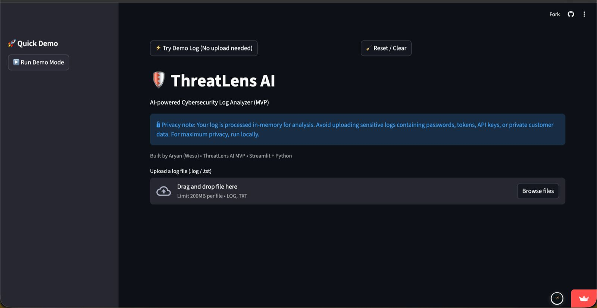
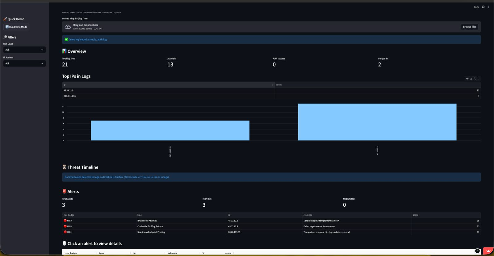
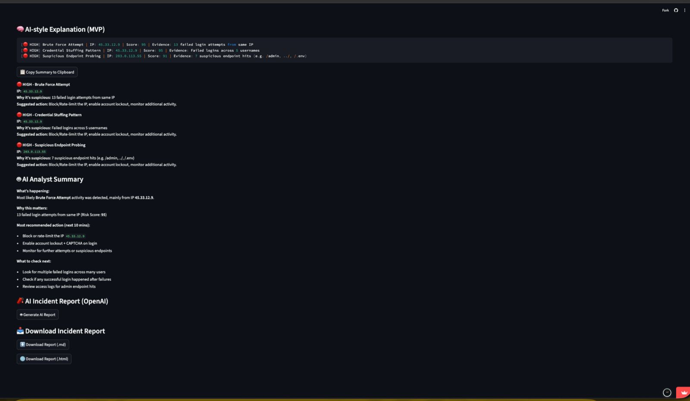

# 🛡️ ThreatLens AI

AI-powered Cybersecurity Log Analyzer built with Python and Streamlit.

ThreatLens AI helps analysts, students, and developers quickly identify suspicious activity from authentication and server logs. The platform automatically detects brute-force attacks, credential stuffing patterns, and suspicious endpoint probing while providing risk scores, visual analytics, and AI-style incident explanations.

---

## 🚀 Live Demo

🔗 https://threatlens-ai-2s2j3gzubm5yym63zhbqnr.streamlit.app/

---

# ✨ Features

## 🔍 Threat Detection

ThreatLens AI automatically detects:

- Brute Force Attempts
- Credential Stuffing Patterns
- Suspicious Endpoint Probing
- High-Risk Authentication Activity

---

## 📊 Security Dashboard

Provides a quick overview of:

- Total Log Lines
- Authentication Failures
- Authentication Successes
- Unique IP Addresses
- Top IPs in Logs

---

## ⚠️ Alert Analysis

Each detected threat includes:

- Threat Type
- Source IP Address
- Evidence
- Risk Score
- Severity Level

Examples:

- HIGH – Brute Force Attempt
- HIGH – Credential Stuffing Pattern
- HIGH – Suspicious Endpoint Probing

---

## 🤖 AI-Style Explanation Engine

ThreatLens generates analyst-friendly explanations including:

- Why the activity is suspicious
- Suggested response actions
- Incident summary
- Investigation recommendations

---

## 📄 Incident Reporting

Generate downloadable reports:

- Markdown Report (.md)
- HTML Report (.html)

Useful for:

- Documentation
- Incident response exercises
- Security portfolio demonstrations

---

# 🏗️ Architecture

```text
┌────────────────────┐
│ Upload Log File    │
└─────────┬──────────┘
          │
          ▼
┌────────────────────┐
│ Log Parser         │
└─────────┬──────────┘
          │
          ▼
┌────────────────────┐
│ Detection Engine   │
│                    │
│ • Brute Force      │
│ • Credential Stuff │
│ • Endpoint Probe   │
└─────────┬──────────┘
          │
          ▼
┌────────────────────┐
│ Risk Scoring       │
└─────────┬──────────┘
          │
          ▼
┌────────────────────┐
│ AI Explanations    │
└─────────┬──────────┘
          │
          ▼
┌────────────────────┐
│ Dashboard & Report │
└────────────────────┘
```

---

# 🔎 Detection Logic

## Brute Force Detection

ThreatLens identifies repeated failed login attempts originating from the same IP address.

Example:

```text
Failed login from 45.33.12.9
Failed login from 45.33.12.9
Failed login from 45.33.12.9
Failed login from 45.33.12.9
```

Generated Alert:

```text
HIGH - Brute Force Attempt
Risk Score: 95
```

---

## Credential Stuffing Detection

ThreatLens detects multiple failed login attempts across different usernames from a single source IP.

Example:

```text
admin
administrator
root
john
test
```

Generated Alert:

```text
HIGH - Credential Stuffing Pattern
Risk Score: 95
```

---

## Endpoint Probing Detection

ThreatLens detects requests targeting sensitive endpoints.

Examples:

```text
/admin
/.env
/config
/phpmyadmin
```

Generated Alert:

```text
HIGH - Suspicious Endpoint Probing
Risk Score: 91
```

---

# 📈 Sample Output

```text
Threat Type:
Brute Force Attempt

Source IP:
45.33.12.9

Risk Score:
95

Evidence:
13 failed login attempts from same IP

Recommended Action:
Block or rate-limit source IP
Enable account lockout
Monitor further activity
```

---

# 📷 Screenshots

## Dashboard



---

## Threat Detection & Alert Analysis



---

## AI Analysis & Incident Reporting



---

# 🎯 Use Cases

## Security Analysts

Quickly identify suspicious authentication activity.

## Students

Learn cybersecurity monitoring and incident response concepts.

## Developers

Validate application authentication logs.

## Cybersecurity Enthusiasts

Practice log analysis and threat detection workflows.

---

# 🧰 Tech Stack

- Python
- Streamlit
- Pandas
- Plotly
- Git
- GitHub
- Streamlit Community Cloud

---

# 📂 Project Structure

```text
threatlens-ai/
│
├── assets/
│   └── screenshots/
│
├── src/
│   ├── detectors.py
│   ├── intelligence.py
│   ├── reports.py
│   ├── story.py
│   └── utils.py
│
├── tests/
│
├── app.py
├── requirements.txt
├── README.md
│
├── sample_auth.log
├── demo_bruteforce.log
└── demo_endpoint_probe.log
```

---

# 🛣️ Roadmap

## Version 1.1

- MITRE ATT&CK Mapping
- Better Threat Timeline
- Enhanced Dashboard Metrics
- Improved Alert Visualizations

## Version 1.2

- PDF Incident Reports
- JSON Report Export
- Improved AI Explanations

## Version 1.3

- IP Reputation Lookup
- VirusTotal Integration
- AbuseIPDB Integration

## Version 2.0

- Real-Time Log Monitoring
- FastAPI Backend
- Multi-User Dashboard
- Docker Deployment

---

# ▶️ Run Locally

```bash
git clone https://github.com/25-THEBEaST-25/threatlens-ai.git

cd threatlens-ai

pip install -r requirements.txt

streamlit run app.py
```

---

# 🤝 Contributing

Contributions, suggestions, and feedback are welcome.

Areas of interest:

- Threat Detection Logic
- Security Research
- UI/UX Improvements
- AI Integration
- Documentation

Feel free to open an Issue or Pull Request.

---

# 👨‍💻 Author

Aryan Wesavkar

Cybersecurity Enthusiast • Computer Engineering Student • Builder of ThreatLens AI

---

# 📜 License

This project is intended for educational and cybersecurity learning purposes.
