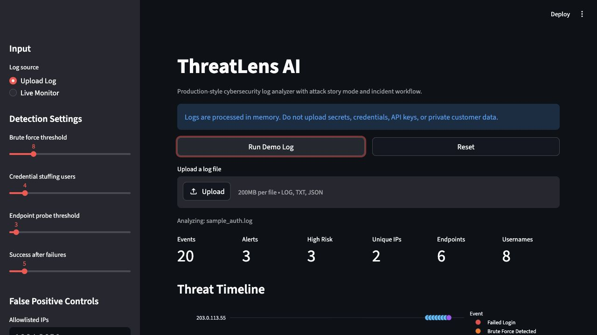
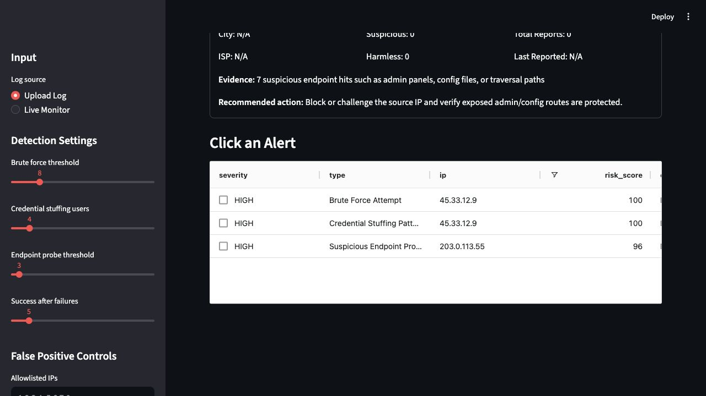
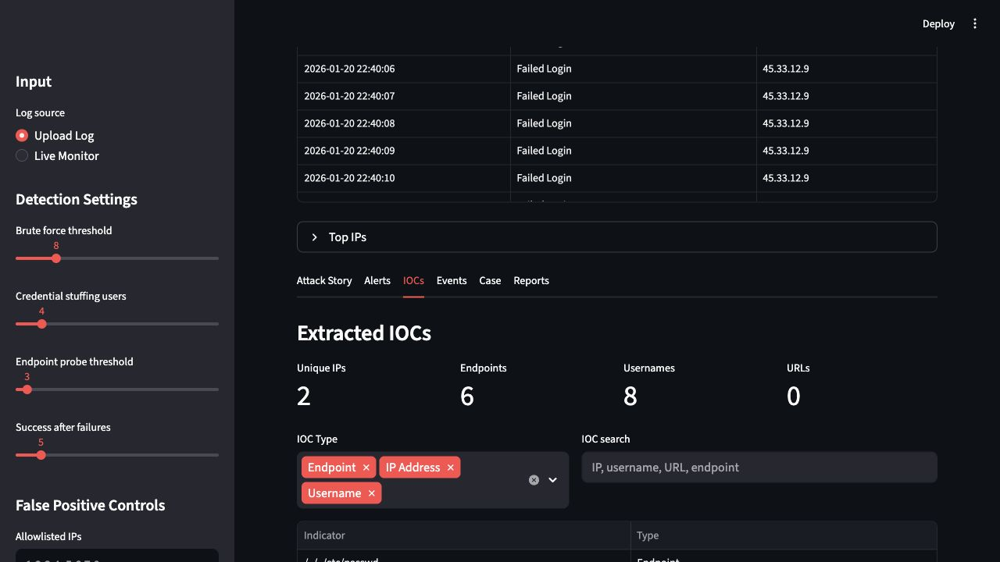

# 🛡️ ThreatLens AI


An AI-powered cybersecurity investigation assistant that transforms raw security logs into actionable incident investigations, attack narratives, analyst recommendations, and downloadable case reports.

---

# 📖 Overview

ThreatLens AI is designed to simplify security investigations by automatically parsing multiple log formats, detecting malicious activities, enriching findings with threat intelligence, and generating AI-assisted investigation reports.

Instead of presenting isolated alerts, ThreatLens AI reconstructs the complete attack timeline, helping analysts understand what happened, why it happened, and what actions should be taken next.

---

# 🖼️ Screenshots

| Timeline Dashboard | MITRE + GeoIP Alerts | IOC Extraction |
|---|---|---|
|  |  |  |

---

# ✨ Features

- 📂 Multi-format log ingestion
- 🔍 Automated threat detection
- 🤖 AI-generated attack narratives
- 📊 Interactive SOC dashboard
- 🛡️ Threat intelligence enrichment
- 📄 Incident report generation
- 📋 Case management workflow
- 💻 Analyst command suggestions
- ⚙️ False positive reduction using allowlists
- 📥 Downloadable investigation reports

---

# 🚀 What Makes ThreatLens AI Different

### 🧠 Attack Story Mode

Transforms scattered log events into a chronological attack narrative for easier investigations.

---

### 🛠️ SOC Command Assistant

Suggests Linux investigation commands such as:

- grep
- journalctl
- last
- lastb
- who
- netstat
- ss

to help analysts validate suspicious activity.

---

### 📂 Case Workflow

Track investigations with:

- Case Owner
- Investigation Status
- Analyst Notes
- Risk Score
- Downloadable Case Reports

---

### 🌍 Threat Intelligence Layer

Supports:

- Local behavioral enrichment
- Optional AbuseIPDB lookups
- Reputation-based scoring

---

### 🎯 False Positive Controls

Reduce noisy alerts using:

- Trusted IP allowlists
- Internal network exclusions
- Trusted User-Agent filtering

---

# 📥 Supported Log Formats

ThreatLens AI auto-detects the format of each line as it parses a log, so mixed-format files work out of the box:

| Format | Example Source |
|---|---|
| JSON (structured) | Cloud/app JSON event logs |
| Syslog / SSH auth | `/var/log/auth.log`, `sshd` |
| Web access (Nginx/Apache) | Combined/common log format |
| ISO-timestamped text | Generic timestamped app logs |

Sample logs are included in the repo root (`sample_auth.log`, `demo_bruteforce.log`, `demo_endpoint_probe.log`) — upload them in the UI to try the app immediately.

---

# 🔎 Detection Coverage

| Threat | Detection |
|----------|:---------:|
| Brute Force Authentication | ✅ |
| Credential Stuffing | ✅ |
| Successful Login After Failures | ✅ |
| Admin Endpoint Probing | ✅ |
| Directory Traversal Attempts | ✅ |
| Scanner User Agents | ✅ |
| Suspicious Endpoint Enumeration | ✅ |
| Threat Intelligence Enrichment | ✅ |

---

# 🏗️ Architecture

```text
                    Security Logs
                           │
                           ▼
                 Log Parsing Engine
                           │
                           ▼
                  Detection Pipeline
        ┌──────────────────────────────────┐
        │ Brute Force Detection            │
        │ Credential Stuffing              │
        │ Endpoint Probing                 │
        │ Scanner Detection                │
        └──────────────────────────────────┘
                           │
                           ▼
             Threat Intelligence Layer
           (Behavior + AbuseIPDB Lookup)
                           │
                           ▼
               AI Investigation Engine
                           │
            ┌──────────────┴──────────────┐
            ▼                             ▼
     Attack Story                 Analyst Commands
            │                             │
            └──────────────┬──────────────┘
                           ▼
                  Incident Report Generator
                           │
                           ▼
                 Streamlit Investigation UI
```

---

# 🛠️ Tech Stack

| Category | Technology |
|------------|------------|
| Language | Python |
| Framework | Streamlit |
| AI | OpenAI GPT |
| Data Processing | Pandas |
| Threat Intelligence | AbuseIPDB |
| Visualization | Plotly |
| Testing | unittest |

---

# 📁 Project Structure

```text
threatlens-ai/

├── app.py                  # Streamlit UI and app entry point
├── src/
│   ├── config.py            # Detection thresholds and settings
│   ├── utils.py              # Log parsing helpers
│   ├── detectors.py          # Brute force / credential stuffing / probing detection
│   ├── ioc.py                 # IOC extraction (IPs, hashes, URLs, etc.)
│   ├── intelligence.py     # MITRE ATT&CK mapping + alert enrichment
│   ├── geoip.py               # GeoIP lookups
│   ├── reputation.py       # IP reputation scoring / AbuseIPDB
│   ├── story.py                # AI attack narrative generation
│   ├── reports.py            # Downloadable case report generation
│   ├── cases.py                # Case management workflow
│   └── monitor.py            # Real-time monitoring helpers
│
├── tests/
│   └── test_detection.py
├── docs/
│   └── screenshots/
├── assets/
├── sample_auth.log           # Example SSH auth log
├── demo_bruteforce.log       # Example brute-force demo log
├── demo_endpoint_probe.log   # Example endpoint-probing demo log
├── requirements.txt
├── requirements-dev.txt
├── .env.example
├── .streamlit/secrets.toml.example
├── Dockerfile
└── README.md
```

---

# ⚡ Run Locally

```bash
git clone https://github.com/25-THEBeaST-25/threatlens-ai.git

cd threatlens-ai

python3 -m venv .venv

source .venv/bin/activate

python -m pip install -r requirements.txt

python -m streamlit run app.py
```

---

# 🐳 Run with Docker

```bash
# Build the image
docker build -t threatlens-ai .

# Run (no API keys — local detection only)
docker run -p 8501:8501 threatlens-ai

# Run with optional threat-intel keys
docker run -p 8501:8501 \
  -e VT_API_KEY=your_vt_key \
  -e ABUSEIPDB_API_KEY=your_abuseipdb_key \
  threatlens-ai
```

Open http://localhost:8501 in your browser.

---

# ⚙️ Configuration

| Variable | Where | Purpose |
|---|---|---|
| `OPENAI_API_KEY` | `.streamlit/secrets.toml` | AI report generation |
| `VT_API_KEY` | `.env` or env var | VirusTotal enrichment (optional) |
| `ABUSEIPDB_API_KEY` | `.env` or env var | IP reputation lookups (optional) |

Copy `.env.example` → `.env` and `.streamlit/secrets.toml.example` → `.streamlit/secrets.toml`, then fill in the keys you need. The app runs fully without any keys configured (local behavioural detection only).

---

# 🤖 OpenAI Integration

ThreatLens AI can generate AI-powered investigation reports.

Configure Streamlit secrets:

```toml
OPENAI_API_KEY="your-api-key"
```

---

# 🌍 AbuseIPDB Integration

Enable **Use AbuseIPDB API** from the sidebar.

Paste your API key when prompted.

If no API key is supplied, ThreatLens AI automatically falls back to local behavioral enrichment.

---

# 🧪 Running Tests

```bash
python -m unittest discover -s tests
```

---

# 📊 Example Workflow

```text
Upload Logs
      │
      ▼
Automatic Parsing
      │
      ▼
Threat Detection
      │
      ▼
Threat Intelligence
      │
      ▼
AI Investigation
      │
      ▼
Attack Story
      │
      ▼
Incident Report
      │
      ▼
Case Dashboard
```

---

# 📈 Roadmap

- [x] Multi-format log parser
- [x] Brute force detection
- [x] Credential stuffing detection
- [x] AI attack narratives
- [x] Threat intelligence enrichment
- [x] Case workflow
- [x] Analyst command suggestions
- [x] MITRE ATT&CK mapping
- [x] IOC extraction (IPs, hashes, URLs, domains)
- [x] GeoIP enrichment
- [x] Docker support
- [ ] Sigma Rule generation
- [ ] SIEM connectors
- [ ] Real-time log monitoring

---

# 🔒 Security Notes

- Tune detection thresholds before automated blocking.
- Maintain allowlists for trusted infrastructure.
- Never upload logs containing passwords, tokens, API keys, or confidential customer data.
- Store API keys using Streamlit Secrets or your deployment platform's secret manager.

---

# 👨‍💻 Author

**Aryan Wesavkar**

Cybersecurity • AI • Backend Development

---

# 📄 License

Licensed under the MIT License.
